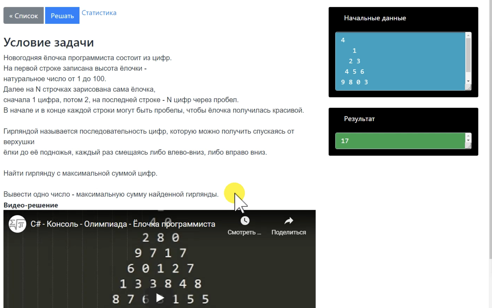

# Задачи на динамическое программирование

## Цель:

В этом домашнем задании вы научитесь решать задачи на динамическое программирование.

## Описание/Пошаговая инструкция выполнения домашнего задания:

### Часть 1. Четыре маленькие задачи. +4 байта.

Решите 4 задачи по материалам вебинара,
желательно на разных языках программирования.
Можно использовать авторскую систему тестирования
для проверки правильности решения, страница авторизации:

1. "Раз/два горох" +1 байт

   **Суслик и Хома** нашли кладовку с горохом и решили его поделить.

- Ты чего мой горох берёшь!
- Как твой?
- Подо мной, значит мой!
- Ах так? Тогда давай делить!
- Давай!

Суслик набрал себе a/b гороха, а Хома c/d гороха от общего количества.

**Начальные данные**

`2/10+3/10`

**Результат**

`1/20`
Найдите дробь, которая покажет, какую часть
от общего количества гороха они себе набрали.

Ответ записать в виде несократимой дроби.
Значение каждой дроби меньше единицы,
сумма дробей не больше единицы.

## Начальные данные:

одна строка в виде a/b+c/d.
Строка записана именно в таком формате,
вместо букв записаны числа, каждое число от 1 до 10000.

## Вывод результата:

ответ в виде x/y, представляющих собой несократимую дробь.
Максимальное значение дроби 1/1.

x a c
--- = --- + ---
y b d

Укажите в отчёте, сколько времени ушло на решение этой задачи.

2. "Цифровая ёлочка" +1 байт
   
3. "Пятью-восемь" +1байт
   
4. "Острова" +1 байт.
   

Укажите в отчёте, сколько времени ушло на решение этих задач.

### Часть 2. Большой и маленький сарай. +6 байт.

Фермер хочет построить на своей земле как можно больший по площади сарай.
Но на его участке есть деревья и хозяйственные постройки, которые он не хочет никуда переносить.
Для удобства представим ферму сеткой размера N × M.
Каждое из деревьев и построек размещается в одном или нескольких узлах сетки.
Найти максимально возможную площадь сарая и где он может размещаться.

#### Начальные данные:

Введите матрицу размера N × M из 0 и 1.
1 соответствует постройке, 0 - пустой клетке.

**Входные данные:**
На первой строке вводится размер матрицы N M (через пробел) от 1 до 1000.
На второй строке вводится количество построек T (от 0 до 10000).
Далее на T строках вводятся координаты построек двумя числами X Y, где 0 <= X < N; 0 <= Y < M.

**Вывод результата:**
Число, соответствующее максимальной площади сарая (количество ячеек).

#### Решение задачи разделено на 4 этапа:

1. Маленький сарай. Решение задачи простым перебором, +1 байт.
   # Условие задачи

2. Длина сарая. Вычисление максимальной длины сарая для каждой клетки, +2 байта
   [Ссылка на задачу](https://www.robotsharp.info/index.php?page=TaskInfo&taskId=1739)

   Укажите в отчёте, сколько времени ушло на решение этой задачи.

3. Ширина сарая. Вычисление максимально доступной ширины для выбранной длины. +2 байта.
   [Ссылка на задачу](https://www.robotsharp.info/index.php?page=TaskInfo&taskId=1741)

   Укажите в отчёте, сколько времени ушло на решение этой задачи.

4. Большой сарай. Совмещение всех решений в одну программу. +1 байт
   [Ссылка на задачу](https://www.robotsharp.info/index.php?page=TaskInfo&taskId=1738)

   Укажите в отчёте, сколько времени ушло на решение этой задачи.
